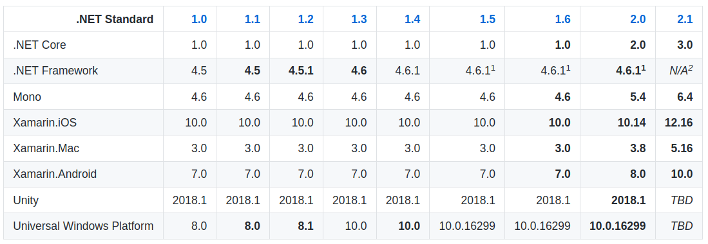

.NET Standard is the definition of a contract, a series of APIs, that all .NET frameworks must implement to be considered a .NET framework.  .NET Framework, .NET Core, Xamarin, and Mono all implement various .NET Standard versions (or specifications) and this now becomes a vehicle for you to build your class libraries to be re-usable across various version of .NET.

[.NET Standard specifications](https://github.com/dotnet/standard) are managed in the open with definitions fore APIs and frameworks that .NET can be used with.

Class libraries can be built and target different version specifications of .NET Standard.  You can target _ANY_ version of .NET Standard and gain compatibility across .NET Framework and .NET Core, but we recommend you target at least _.NET Standard 2.0_

## Implications

For your existing Web Forms applications, unless you are executing unsafe code or p-invoking methods, you should be able to migrate much of your application's business logic to a .NET Standard targeting class library.  This has several benefits:

1. You can migrate your business logic to the .NET Standard class library project, reference that project, and continue to use that logic in your ASP.NET Web Forms application.
1. Your new .NET Standard class library project can be _DIRECTLY_ referenced by your migrated ASP.NET Core / Server-side Blazor application
1. Your business logic code is now isolated from your presentation code, and should be more testable.  Write some unit tests to verify that your business logic is behaving properly.
1. If you'd like to write a mobile application to work with your web application, you can re-use your .NET Standard project with the Xamarin frameworks.

## API Portability

Portability is not guaranteed when you migrate business logic to .NET Standard.  APIs have been changed or even removed in some cases.  You should test your libraries and application for portability and take direction for possible migration paths using the official [.NET Portability Analyzer](https://docs.microsoft.com/en-us/dotnet/standard/analyzers/portability-analyzer).

## Sample 1: Update an existing class library

The first sample demonstrates updating a simple class library to .NET Standard.  In this model, we're assuming that you already have your business logic code properly separated from your user-interface and managed inside a class-library project that targets .NET Framework 4.6.1.  You can find it in [samples/netstandard-1](../samples/netstandard-1/README.md) folder.

## Sample 2: Refactoring Business Logic

The second sample shows how to take an existing ASP.NET application and refactor our some business logic as a .NET Standard project.  You can find the source and directions for this sample in the [samples/netstandard-2](../samples/netstandard-2/README.md) folder.
